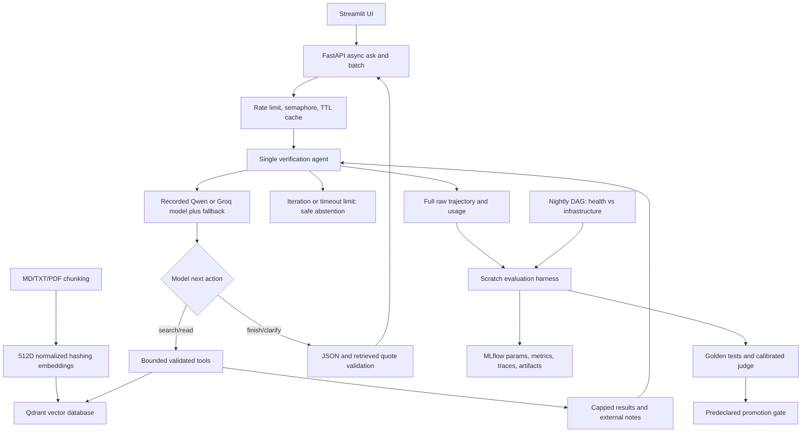

# Track B — MLOps Knowledge Assistant

Royas Shakya's standalone W15 assistant, W16 agentic verification feature, and W17 MLOps layer. Track A is a separate repository. Built from the assignment PDFs and implementation plan, without reading or reusing existing projects.

**Status:** Task B core checks pass **31/31**; **78 engineering tests** and required CI pass. Production is Qwen3-14B-AWQ v34, MLflow run `1e0bc9bd432a426ca5c4e5e76e127490`: 100% golden truth, 81.48% joint native 120B judge pass, complete usage and zero hard/provider failures. The real production API concurrency/cache/batch checks and 18/18 healthy Airflow regression pass. All 23 completed native-judged configurations and failed/partial preflights are preserved. Cloud deployment remains an optional extension requiring an account, target and budget.

## Quick start

```bash
uv sync --locked
cp .env.example .env
# Set AGENT_API_KEY locally. Gemini's compatible API is the default.
uv run uvicorn assistant_mlops.api:app --port 8000
# In a second terminal:
uv run streamlit run src/assistant_mlops/ui.py
```

Open http://localhost:8501, or POST `{"question":"What happens after drift and what permits promotion?"}` to http://localhost:8000/ask. POST /batch accepts `{"questions":[{"question":"What is the retry limit?"}]}` (up to eight). The corpus is a fictional example-company MLOps handbook, explicitly labeled in each source; replace corpus/ files with your approved documents. There is no claim to access your organization's real policies. Supported ingestion: Markdown, text, PDF. Query responses are validated JSON with answered/abstain/clarify status and exact retrieved citations. /health distinguishes initialized service from configured provider access. Without access, /ask abstains instead of silently returning a fixture answer.

## W15 implementation and deployment

The W15 baseline at POST /rag makes one application-directed retrieval and one completion (rag.py). W16 POST /ask adds model-directed adaptive cross-source verification; it is not just a fixed RAG sequence repeated. The backend integrates the authenticated KU vLLM endpoint, Groq, or Gemini through compatible chat/function-calling APIs. The verified W15 baseline uses Groq; configuration experiments record the chosen agent model. Prompt files and YAML expose temperature/top_p and retrieval settings. Every requested tool is validated against the bounded retrieval tools search/read_source; opt-in native final answers use a validated json submission tool. Retrieval chunks documents (900 characters, 150 overlap), computes normalized 512-dimensional hashing embeddings, and indexes them in Qdrant. Hashing embeddings are lightweight lexical embeddings rather than pretrained semantic embeddings; collisions and paraphrase recall are limitations, measured by the same harness when an embedding model is changed. The local Qdrant database can persist with QDRANT_PATH; the default in-memory collection is rebuilt from the versioned corpus on startup.

Provider requests are asynchronous, retried three times with exponential backoff for transient errors, with an optional separately configured fallback. Both endpoints obey the same output/citation contract. Requests are bounded by four concurrent model calls and a 180-second timeout by default. Paced configurations receive a derived deadline, capped at 900 seconds, to include queued model calls. Batch requests consume per-query rate-limit budget (30 per client per minute). An LRU cache holds at most 128 answered/clarification responses for 300 seconds and fingerprints corpus, prompt, configuration, and provider. Concurrent identical requests share one computation. Infrastructure failures are never cached as success. Rate limits/cache are per-process; the documented single-worker deployment preserves that scope. A multi-worker deployment would need a shared store.

### vLLM and optimization

On a GPU host:

```bash
cd serving
uv sync --locked
export VLLM_API_KEY='set-locally'
bash serve_vllm.sh
# Or: docker compose -f compose.yaml up -d
```

Use Qwen/Qwen2.5-7B-Instruct on 24 GB GPU, an AWQ quantized variant on 12 GB, or Qwen2.5-3B-Instruct for the cost-axis experiment. Set laptop AGENT_BASE_URL=https://your-stable-hostname/v1, AGENT_MODEL to the exact served model name, and AGENT_API_KEY to the bearer token. serving/named_tunnel.md explains a named Cloudflare tunnel. vLLM uses continuous batching, KV caching, and GPU inference; the application does not reimplement those optimizations. ONNX conversion is not applicable to this API assistant because it does not train or own model weights and vLLM owns autoregressive decoding; quantization is the supported optional optimization. Real KU GPU inference and native tool calls passed; see reports/provider_connection.json. No GPU throughput improvement or quantization benchmark is claimed.

```bash
# .env must exist before Compose reads env_file.
docker compose up -d --build backend ui mlflow
# Optional, after production baseline exists:
docker compose --profile airflow up -d --build airflow
```

UI :8501 by default (override ASSISTANT_UI_PORT in .env); API :8000; MLflow :5000; Airflow :8080, all bound to localhost. See deploy/cloud.md for the cloud bonus procedure and required account information. No cloud deployment is claimed here.

## W16 — implementation write-up (approximately one page)

**Why a fixed pipeline is insufficient:** cross-source policy verification needs to resolve missing caveats and superseded memos based on intermediate evidence, so the next search and stopping decision cannot be fixed in advance.

### a. Context Engineering Technique

Retrieval caps top_k at three by default. After each model-selected tool call, older verbose tool results are shortened to 650 characters while the full raw output stays in the external trace. After 22 context messages, complete older tool turns are replaced by structured per-source notes capped at 5,000 characters. The assistant can read a source again to recover a caveat. This prevents repeated searches from crowding out the question and policy instructions while preserving native tool-call/result protocol pairs. Compaction can lose details; citation validation uses actual accumulated evidence and evaluation tracks failures rather than assuming compaction is free.

### b. Agentic Pattern

One agent owns the verification loop, with at most seven model iterations and four tools per iteration. The model chooses whether to search again, read another source, clarify, or finish. The application validates execution and stops unsafe output; it does not schedule a predetermined series of searches. A single agent suits this small corpus because search and read are bounded capabilities, not independently specialized research tasks. Adding agents would introduce coordination tokens and more failure boundaries without demonstrated benefit. Context saturation is handled by caps/notes instead. No multi-agent baseline comparison is needed for this single-agent design.

### c. Evaluation Harness

The scratch-built harness runs 35 development questions across seven categories, with per-case iteration budgets and three repeats. Task completion checks approved status, required factual terms, required source coverage, and step budget; term-based checks can falsely fail valid paraphrases, so judge results are a separate semantic signal. Tool argument validity and appropriate tool evidence are measured separately. Appropriate calls must retrieve a required source when the case specifies sources; broader exploratory searches may be counted incorrect, a known strictness. Trajectory length, provider-reported total tokens, latency, and repeated-run spread are recorded for every query. Missing usage is marked incomplete rather than guessed. Failures are hard (provider unavailable/unsafe budget), soft (incorrect or insufficient answer), or cascading soft (repeated invalid answers/tool errors). tests/ uses scripted protocol fixtures; these are engineering tests, never substitutes for live harness results.

**Skill vs. Agent:** a skill could describe policy interpretation, but cannot replace adaptive evidence collection and sufficiency decisions; search and read_source remain bounded tools, and no extra agent was added.

**Token and cost:** traces aggregate upstream prompt/completion/total tokens per request. Set INPUT_USD_PER_MILLION and OUTPUT_USD_PER_MILLION from your billing plan to log estimated cost; prices are not hardcoded. Unknown total usage blocks promotion. If input/output counts are missing, estimated dollar cost is null and cost_usage_coverage reports the gap; a false zero-cost estimate is never logged. Cached requests report zero new model tokens. No coordination cost is asserted because there is only one agent.

**Failure injection:** timeout, unavailable retrieval, and malformed retrieval are injected persistently. The trace records evidence_valid=false. The model can recognize the failure and abstain/clarify; application validation also rejects answered responses after any tool failure, and the iteration budget guarantees termination. Protocol tests exercise these paths. Completed live runs record injected retrieval safety separately from provider availability; raw trajectories and per-run metrics preserve the behavior.

**Tool vs. Agent boundary:** Qdrant search, source reading, and the remote model endpoint are bounded request/response services, modeled as tools/provider calls. They do not own an autonomous task across exchanges or invoke a hidden collaborating agent. The assistant loop owns state, budget, retry boundary, and evidence. vLLM's stateful KV cache is an inference implementation detail within that boundary.

The [live evaluation runtime](docs/evaluation-runtime.md) documents checkpoints, authentication-only reserve-key failover, and native Groq judge caching. Gemini remains an alternative judge.

The active [provider allocation](docs/provider-allocation.md) records the agent model per configuration, uses Groq for `/rag` and native judging, and retains Gemini as an alternative. GPT-OSS agents share the judge family; 20B agents share its weights, so separate requests do not establish independent-model validation.

GPU proxy authentication and the later Groq switch are documented in [docs/provider-setup.md](docs/provider-setup.md). Check live access with `uv run python scripts/check_provider.py` before evaluation.

## W17 a. Environment & Reproducibility (uv)

`uv sync --locked` recreates the assistant environment. MLflow 2.22.2 needs SQLAlchemy 2.0.41; Evidently is pinned at 0.7.23 for tested descriptor/report APIs. Native LLM evaluation uses evidently[llm], with pinned CPU-only torch/transformers so an application laptop does not install CUDA libraries. GPU serving has its own serving/uv.lock and environment, avoiding incompatible torch requirements. Dockerfile.airflow installs the project in an isolated venv so it cannot replace Airflow's dependencies.

## W17 b. Experiment Tracking Strategy (MLflow)

Datasets are authored before experiments: 35 dev cases, 18 golden regression cases, and 15 proposed calibration labels, seven deliberately wrong. Corpus facts, not agent output, are the source of truth. Golden paraphrases overlap dev facts; this measures regression, not independent generalization. Review proposed labels yourself before claiming human agreement (datasets/README.md).

Start the tracking service with `docker compose up -d --build backend mlflow`; the .env template points host experiments at http://localhost:5000 so they appear in the same Docker MLflow UI. For a file-only workflow, explicitly set MLFLOW_TRACKING_URI=sqlite:///mlflow.db and start a local MLflow viewer against that database. Run v1 first:

```bash
uv run python -m assistant_mlops.experiment run --config configs/v1.yaml --judge
```

The command logs configuration, prompt and corpus hashes, all dev/golden raw tool traces, usage, harness report, native nested MLflow spans, deterministic Evidently report, judge report, and promotion gate. Runs use three repeats; 35×3 dev +18×3 golden means 159 queries/version before judge calls. Judge costs are additional. Sampling spread is compared with production. No API caching is used during experiments.

Inspect failed **development** traces before changing one prompt axis. Write reports/diagnosis_v2.json with trace_path, failure, and change fields; cite an actual prior trace and revise prompt_v2.md. The revised prompt header must name that dev trace. Repeat for v3; diagnosis validation rejects golden traces or a mismatched preceding version. Draft candidates in prompts/ are suggestions only; do not treat them as observed diagnoses.

```bash
uv run python -m assistant_mlops.experiment run --config configs/v2.yaml --judge --diagnosis reports/diagnosis_v2.json
uv run python -m assistant_mlops.experiment run --config configs/v3.yaml --judge --diagnosis reports/diagnosis_v3.json
# v4 lowers max_iterations only for the cost trade-off; cite its motivation too.
uv run python -m assistant_mlops.experiment run --config configs/v4.yaml --judge --diagnosis reports/diagnosis_v4.json
uv run python -m assistant_mlops.experiment compare
uv run python -m assistant_mlops.experiment promote --run-id ACTUAL_RUN_ID
```

Only explicit promotion changes configs/production.yaml. After promotion, leave ASSISTANT_CONFIG empty to select the promoted version automatically, or set an explicit override. Recreate the backend to load the selected configuration; it stays fixed for the lifetime of that process. Compose mounts the versioned configuration directory read-only. Reject experiments remain in tracking/history. Production is explicitly selected by the completed all-PASS v34 run. Its API health reports configuration v34, and `ASSISTANT_CONFIG` is blank so startup selects the promoted configuration. reports/mlflow_comparison.md is exported from actual MLflow state; reports/completed_experiments.md presents only fully judged runs. Lower token usage is not sufficient for promotion.

### Measured results

Each completed version records all 159 actual agent attempts, including provider failures, and native judge reports. Frozen golden data and gate thresholds stay unchanged. Source/model revisions are motivated by preceding development traces only.

| Version | Dev completion | Golden truth | Judge pass | Dev tokens/query | Gate |
|---|---:|---:|---:|---:|---|
| v1 | 47.62% | 44.44% | 48.15% | 4197.86 | REJECT |
| v3 | 50.48% | 57.41% | 42.59% | 1727.01 | REJECT |
| v4 | 51.43% | 57.41% | 42.59% | 1566.69 | REJECT |
| v5 | 66.67% | 72.22% | 50.00% | 2972.55 | REJECT |
| v14 | 96.19% | 64.81% | 50.00% | 5571.54 | REJECT |
| v15 | 60.00% | 38.89% | 22.22% | 1332.15 | REJECT |
| v17 | 98.10% | 87.04% | 79.63% | 1842.15 | REJECT |
| v18 | 98.10% | 96.30% | 85.19% | 2280.06 | REJECT |
| v19 | 97.14% | 59.26% | 40.74% | 2055.54 | REJECT |
| v25 | 61.90% | 62.96% | 64.81% | 3810.77 | REJECT |
| v32 | 92.38% | 100.00% | 77.78% (20B judge) | 3908.69 | REJECT |
| v34 | 94.29% | 100.00% | 81.48% (120B judge) | 3906.07 | PROMOTE |

v4 reduced tokens by 9.28% relative to v3 while preserving its held-out truth score. The 23 fully judged configurations are v1–v12, v14, v15, v17–v22, v25, v32 and v34; v13 and v16 remain KILLED with partial evidence. v18 met the 85% truth and 80% judge floors but retained REJECT because three provider failures made usage incomplete. v19 completed development without provider failures, then lost access in 36/54 held-out samples. Those rejected results did not authorize promotion. Fresh v34 passed every check and was explicitly promoted. v32 used the 20B judge and remains REJECT at 77.78%; v34 uses the calibrated 120B judge. A changed judge does not demonstrate agent improvement. The failed v33 prompt preflight is preserved and was abandoned. The full [comparison](reports/completed_experiments.md), [token/quality chart](reports/cost_quality.png), native reports and raw trajectories preserve all outcomes. Calibration matched all 15 approved labels with zero false passes; its small, assistant-reviewed sample is a limitation.

## W17 c. Monitoring & Regression Strategy (Evidently AI)

Approved references in datasets/golden_v1.jsonl are compared with fresh candidate responses. `LLMEval` uses `BinaryClassificationPromptTemplate` for two native judge descriptors: reference-based factual correctness and completeness (thresholds and caveats included). The current Evidently Test Suite equivalent is Report(include_tests=True), with CategoryCount share tests ≥0.80 for each descriptor. Unknown judge verdicts fail. Per-case joint judge pass, ground-truth pass, and their conjunction are logged as pct_judge_passed, pct_ground_truth_passed, and pct_tests_passed. An independent calibration command evaluates proposed labels and reports agreement/false-pass/disagreement IDs:

```bash
uv run python -m assistant_mlops.experiment judge-check
```

Calibration labels were drafted and audited by the assistant, with delegated review explicitly approved by Royas Shakya. datasets/calibration_review.json records the approval, method, and label-file SHA; it does not claim individual human labeling. The promotion gate requires approved review matching the current label SHA. Read both responses and judge reasoning in judge_verdicts.csv, especially contradictions, caveat omissions, false passes, and safe abstentions. Judge-vs-ground-truth agreement may expose deterministic paraphrase false negatives or judge bias. Judge calls require GEMINI_API_KEY or JUDGE_API_KEY and may need a slower rate limit. HTML reports are committed and logged when genuinely generated. Missing judge evidence rejects promotion. The predeclared gate requires ≥85% ground-truth pass, ≥80% judge pass, ≥80% calibration-label agreement, ≥75% judge/truth agreement, ≥90% tool correctness, ≤5% hard failures, all injected failures safe, and known token usage. With a baseline, completion may not drop beyond max(5 points, twice repeated-run spread), ground truth may not drop >5 points, tokens ≤1.3× and steps ≤1.25×. The golden set is never used to tune prompts.

## W17 d. Orchestration (Airflow bonus)

The nightly DAG checks /models first. An unavailable GPU/tunnel enters infrastructure_failure and fails visibly, rather than reporting a quality regression from no answers. A healthy endpoint runs a dedicated ground-truth-only nightly module against the production baseline: no paid judge and no promotion. Pass rate below max(0.85, production−0.05), unsafe injected failures, or hard failures >0.05 fail the DAG. Native scheduler and live-model evidence are separate; reports/airflow_infra.txt captures an actual `airflow dags test` run with port 9 deliberately unavailable: infrastructure_failure failed and regression was skipped. This test used the pinned Airflow image without needing model credentials. Model access is verified. The actual healthy v34 run passed all 18 cases at a 95% required threshold; native task states show endpoint_health=success, regression=success and infrastructure_failure=skipped. The deliberate port-9 run shows endpoint_health=success, infrastructure_failure=failed and regression=skipped. The latest deliberate infrastructure run is recorded in airflow_infra_states.json: endpoint health succeeded, infrastructure_failure failed, and regression was skipped. The validated DAG is unpaused and scheduled for 02:00 UTC daily (07:45 Nepal time). Airflow standalone is a development deployment with a generated local admin password, not a cloud production scheduler. Unpause the DAG only after a baseline exists.

## Architecture



## Verification and submission

```bash
uv run ruff check src tests scripts dags
uv run ruff format --check src tests scripts dags
uv run pytest -q
uv run python scripts/check_deliverables.py --static
uv run python scripts/check_deliverables.py
```

Static PASS means implementation files exist, not a completed live submission. Full scorecard deliberately reports PENDING for missing real experiment/judge/production/Airflow evidence. GitHub labels/issues/branch rules, remote main CI, and final release tags cannot be established by local files alone. Do not label this w17-trackB-final until full scorecard passes. A real failure trace and live run comparison are required for a trace-driven claim.

## Verified local services

The Docker UI is currently running at http://localhost:18501 and API at http://localhost:8000/docs. The MLflow UI is http://localhost:5000. `uv run python scripts/smoke_api.py --ui-url http://localhost:18501` verifies UI/backend health and safe abstention without credentials; reports/deployment_smoke.json is infrastructure evidence only. After updating .env credentials, recreate backend with `docker compose up -d --build --force-recreate backend`; startup loads the new values.

## Submission evidence

[Core scorecard](reports/deliverables.md), [production gate](reports/v34/gate.json), [native Evidently report](reports/v34/evidently_judge.html), [nightly status](reports/nightly/status.json), [real screenshots](reports/screenshots/manifest.json), [production API features](reports/api_features_smoke.json), and [Qwen3 session setup](docs/qwen14b-session.md). Both tasks remain separate repositories.
